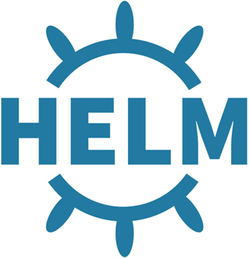
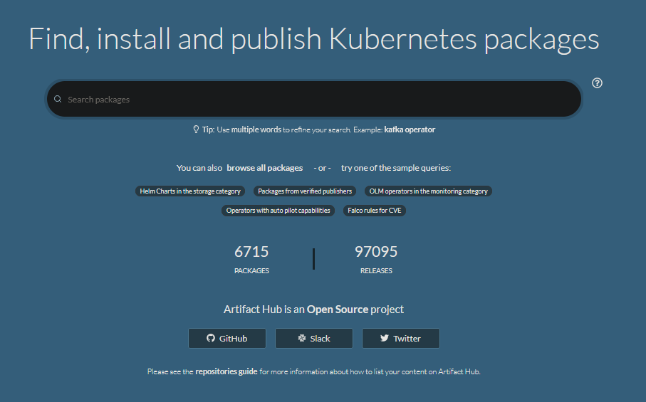
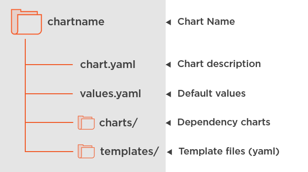
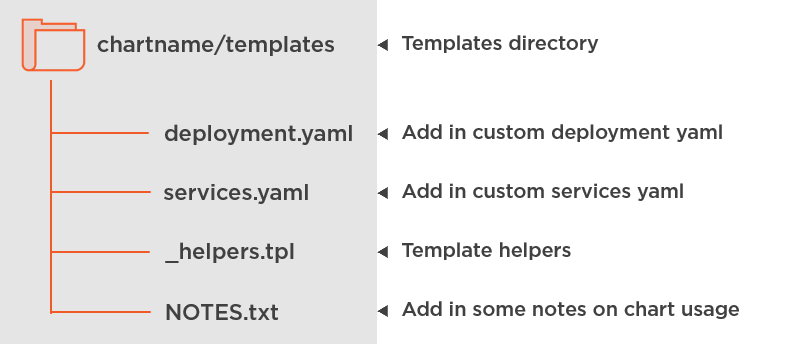

# Deploying Applications to Kubernetes using Helm

---

## Andrew Pruski

### Field Solutions Architect
### Microsoft Data Platform MVP

<!-- .slide: style="text-align: left;"> -->
<i class="fab fa-twitter"></i><a href="https://twitter.com/dbafromthecold">  @dbafromthecold</a> 
<i class="fas fa-envelope"></i>  dbafromthecold@gmail.com 
<i class="fab fa-wordpress"></i>  www.dbafromthecold.com 
<i class="fab fa-github"></i><a href="https://github.com/dbafromthecold">  github.com/dbafromthecold</a>

---

### Session Aim
<!-- .slide: style="text-align: left;"> -->
To provide an overview of Helm and how it can be used to deploy applications to Kubernetes

---

### Agenda
<!-- .slide: style="text-align: left;"> -->
- An overview of Helm 
- Deploying an application 
- Upgrading an application using Helm 
- Rolling back an upgrade using Helm 
- Chart Repositories

---

# Helm

---

### What is Helm?

<!-- .slide: style="text-align: left;"> -->
 

A package manager for Kubernetes 
Charts define applications 
With Helm you can: - 
    - Mange complexity 
    - Easily update and rollback 
    - Share charts 

---

### History of Helm
<!-- .slide: style="text-align: left;"> -->
- Created in 2015 
- Introduced at KubeCon in November 2015 
- Merged with Google's Deployment Manager in January 2016 
- Open source - https://github.com/helm/helm 
- More than 2 million downloads a month 
- Graduated status within the CNCF in April 2020 

---

### Artifact Hub
<!-- .slide: style="text-align: left;"> -->

---

# Demos

---

# Packaging a Chart

---

### Chart Structure
<!-- .slide: style="text-align: left;"> -->

---

### Chart Template Directory
<!-- .slide: style="text-align: left;"> -->

---

# Demos

---

## Resources
<!-- .slide: style="text-align: left;"> -->

<a href="https://github.com/dbafromthecold/DeployingAppsToK8sUsingHelm">https://github.com/dbafromthecold/DeployingAppsToK8sUsingHelm</a> 

